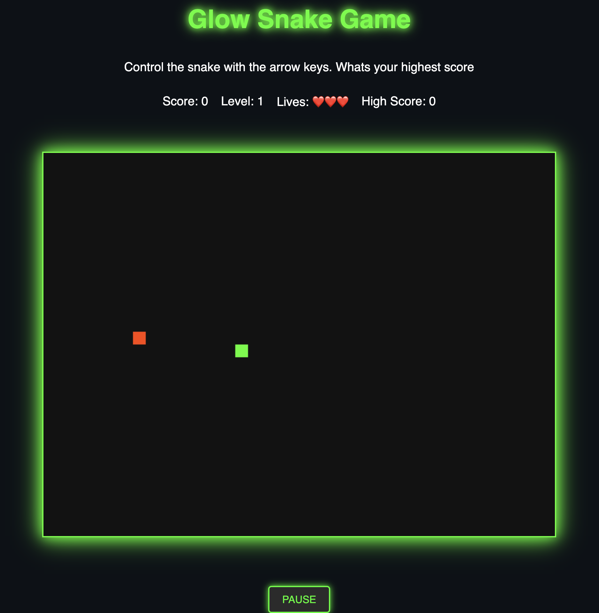

# Futuristic Glow Snake Game



A modern twist on the classic Snake game, set in a retro-futuristic world of neon lights and glowing grids. Collect food, gain points, level up, dodge obstacles, and see if you can beat your own high score!

**Repository:** [https://github.com/wgwhitecoding/snake](https://github.com/wgwhitecoding/snake)

---

## Table of Contents
- [Overview](#overview)
- [Features](#features)
- [How to Play](#how-to-play)
- [Controls](#controls)
- [Game Mechanics](#game-mechanics)
- [Installation & Setup](#installation--setup)
- [Folder Structure](#folder-structure)
- [Future Enhancements](#future-enhancements)
- [Contributing](#contributing)

---

## Overview

**Futuristic Glow Snake Game** is a browser-based Snake clone that combines the charm of the original arcade hit with a vibrant, neon-inspired aesthetic. Your snake glides across a glowing grid, collecting food to grow longer and earn points. As your score climbs, so does the difficulty—new obstacles appear, and the snake’s speed increases. Can you master the levels and maintain your edge as the game intensifies?

---

## Features

- **Neon Visuals:** A lively, futuristic design with glowing snake segments, special foods, and sci-fi-level announcements.
- **Progressive Difficulty:** Speed ramps up, obstacles appear, and special foods grant bonus points as you advance through levels.
- **Multiple Lives:** Start with three lives to give yourself room for error. Lose a life, and you’ll get a chance to continue—no need to restart immediately.
- **Special Food & Power-Ups:** Beyond ordinary snacks, special glowing foods appear at higher levels, rewarding you with big points.
- **High Score Tracking:** Show off your highest score and challenge yourself or friends to beat it.
- **Responsive Design:** Automatically scales the canvas for smaller screens, ensuring the game is playable on both desktop and mobile devices.

---

## How to Play

1. **Start the Game:** Open `index.html` in your browser. You’ll see a glowing grid and a small snake ready to move.
2. **Collect Food:** Guide the snake to the red/orange foods to earn points and grow longer.
3. **Avoid Collisions:** Don’t run into yourself, the screen edges, or obstacles. Doing so costs a life.
4. **Level Up:** Every 1000 points, you advance a level, which may increase speed and add obstacles. At higher levels, special foods appear—grab them for bonus points!
5. **Keep an Eye on Your Lives:** If you lose a life, a modal will appear. If you have lives left, you can continue from where you left off. If not, it’s Game Over.

---

## Controls

**Desktop:**
- **Arrow Keys:** Move Up, Down, Left, Right.
- **Spacebar:** Toggle pause/play.

**Mobile:**
- **Swipe:** Swipe in the direction you want the snake to move.
- **On-Screen Button:** Use the provided pause/play button to manage game state.

---

## Game Mechanics

- **Scoring:** Regular food is worth 100 points. Every 1000 points increases your level and difficulty.
- **Levels & Speed:** Higher levels mean faster snake movement and more obstacles to navigate around.
- **Lives & Continues:** You start with three lives. Each collision costs one life, and you can continue if any remain. Run out of lives and the game ends.
- **Special Food:** Appears in later levels, worth 500 points, glowing brightly to catch your attention.

---

## Installation & Setup

1. **Clone the Repository:**
   ```bash
   git clone https://github.com/wgwhitecoding/snake.git

2. **Navigate to the Project Directory:**
    ```bash
    cd snake

3. **Open the Game: Open index.html in your favorite web browser. No additional setup or dependencies required.**

## Folder Structure


## Future Enhancements

- **More Obstacles & Power-Ups:** Introduce new types of obstacles or power-ups that could affect snake speed or grant invincibility.
- **Skins & Themes:** Allow players to change the snake’s appearance or the background theme.
- **Global Leaderboard:** Implement a feature to submit scores online and compare them with players around the world.
- **Mobile Optimization:** Enhance touch controls for an even smoother mobile experience.

---

## Contributing

Contributions are welcome! To get involved:

1. **Fork** the repository.
2. **Create a new branch** for your feature or bugfix.
3. **Make your changes** and test thoroughly.
4. **Submit a pull request** describing your modifications.

i encourage contributions that improve gameplay, visuals, performance, or code quality.


**Get ready to navigate the glowing grid—good luck achieving the highest score!**
